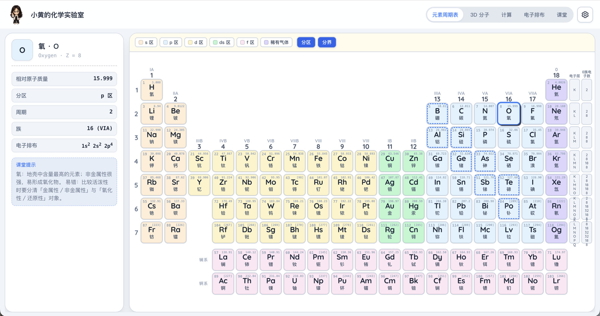
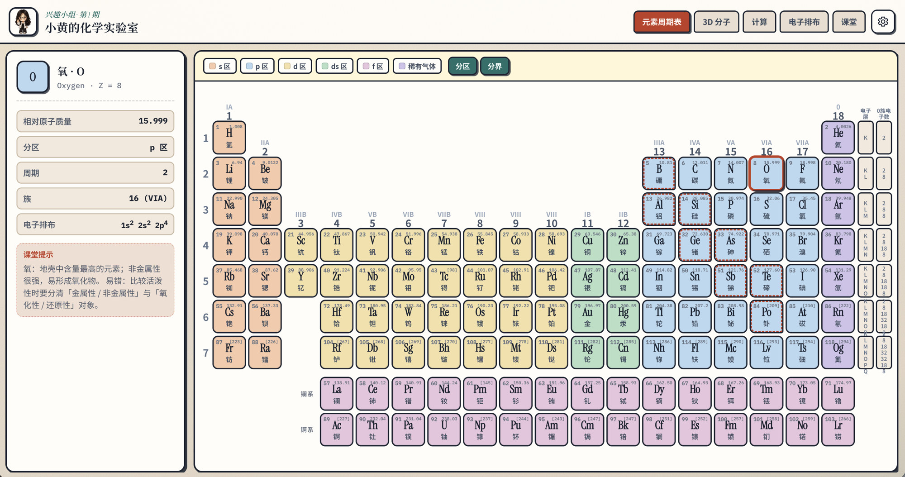
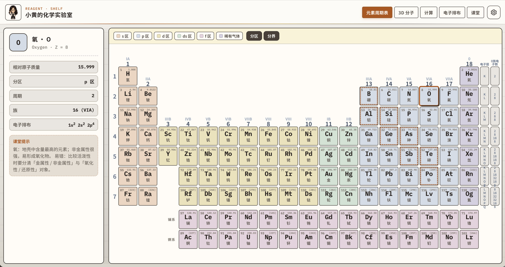
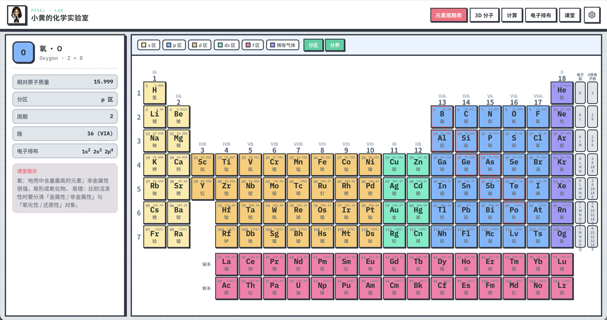
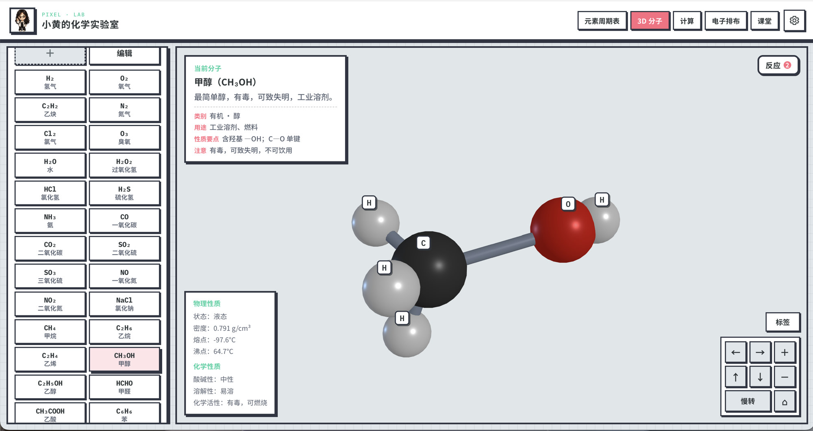
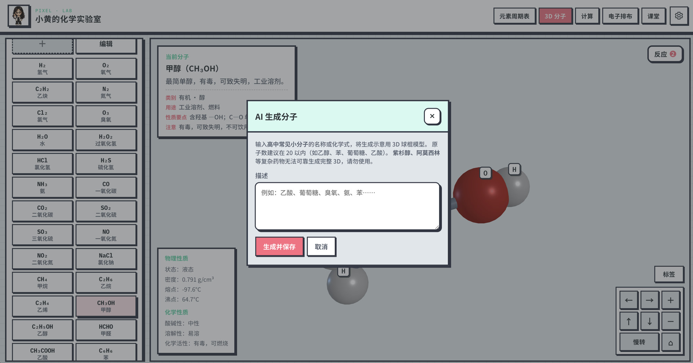
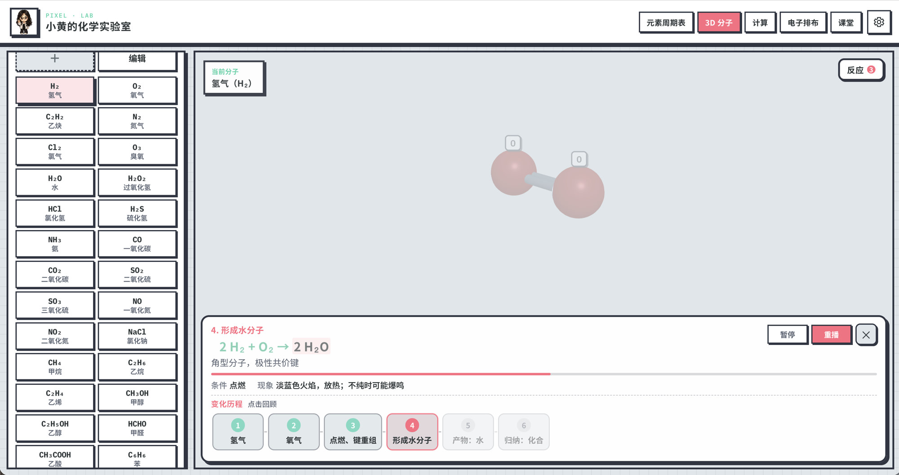
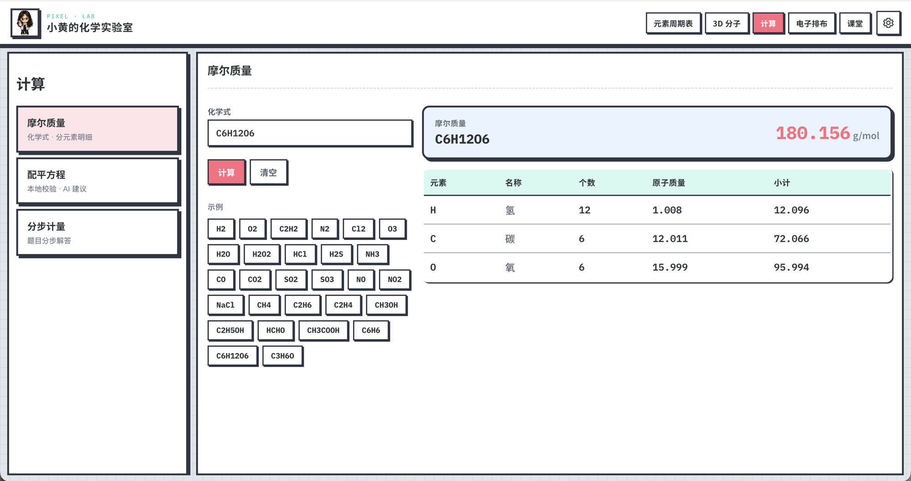
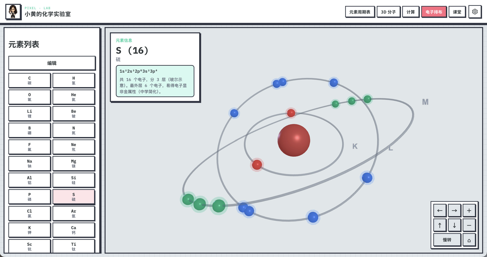
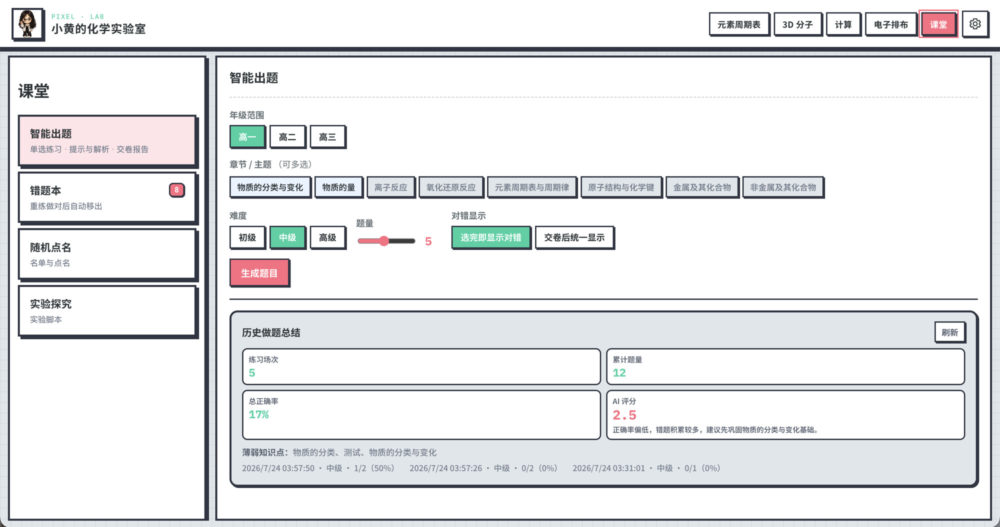

# 小黄的化学实验室

面向**中学化学教学与自学**的本地应用：在教室大屏、教师机或学生自习时，用统一界面完成周期表讲解、3D 分子与反应示意、计算练习、电子排布演示和课堂互动。

数据全部保存在本机 SQLite；可选接入 **DeepSeek API** 做 AI 出题、提示、分子/反应生成等（仅按调用转发提示词，名单与试卷等业务数据留在本机）。

**当前版本：v2.0.0** · 许可证 [MIT](./LICENSE)

<p align="center">
  
</p>

<p align="center"><em>元素周期表 · 点选元素查看详情与课堂提示（默认主题）</em></p>

---

## 目录

- [下载安装](#下载安装推荐)
- [界面预览](#界面预览)
- [功能总览](#功能总览)
- [功能详解](#功能详解)
- [设置与品牌](#设置与品牌)
- [AI 与限流](#ai-与限流)
- [开发运行](#开发运行)
- [技术架构](#技术架构)
- [版本历史](#版本历史)

---

## 下载安装（推荐）

发布页：[Releases · v2.0.0](https://github.com/xingyingyuzhui/XiaoHuang-s-Chemistry-Laboratory/releases/tag/v2.0.0)

| 文件 | 平台 | 说明 |
|------|------|------|
| `XiaoHuang-ChemLab-Setup-2.0.0.exe` | Windows x64 | **Electron 安装包**（推荐，无黑色控制台） |
| `XiaoHuang-ChemLab-2.0.0-mac-arm64.dmg` | macOS Apple 芯片 | Electron 安装盘（M1 / M2 / M3 / M4） |
| `XiaoHuang-ChemLab.exe` | Windows x64 | 路线 B 轻量便携包（有黑色控制台 + 浏览器） |

### Electron 版（Win 安装包 / Mac dmg）

1. 安装或打开应用（窗口内直接使用，无需另开浏览器）
2. 数据目录：
   - Windows：`%AppData%\xiaohuang-chem-lab\data\`
   - macOS：`~/Library/Application Support/xiaohuang-chem-lab/data/`
3. 打开右上角 **设置**，填写 DeepSeek API Key（需要 AI 功能时）

**未代码签名说明**：Windows 可能提示 SmartScreen → 选「仍要运行」；macOS 可能提示无法验证开发者 → 系统设置 → 隐私与安全性 →「仍要打开」，或右键 App → 打开。

### 便携 exe（路线 B）

1. 双击 `XiaoHuang-ChemLab.exe`，**不要关闭黑色控制台**
2. 用控制台里打印的地址打开页面（如 `http://127.0.0.1:3000`）
3. 数据保存在 exe 同目录的 `data/`

---

## 界面预览

多主题下的周期表与主要功能页（截图为 v2.0，像素主题示意居多）。

### 多主题 · 元素周期表

| 默认 | 文具 |
|:----:|:----:|
|  |  |
| **试剂架** | **像素** |
|  |  |

设置 → 主题 还可切换 **黑板** 等皮肤；分区色、顶栏、侧栏卡片会随主题统一变化。

### 3D 分子 · 反应 · 计算 · 电子排布 · 课堂

| 3D 分子 | AI 生成分子 |
|:-------:|:-----------:|
|  |  |

| 反应剧院播放 | 摩尔质量计算 |
|:------------:|:------------:|
|  |  |

| 电子排布 | 课堂 · 智能出题 |
|:--------:|:---------------:|
|  |  |

---

## 功能总览

| 顶栏模块 | 主要能力 |
|----------|----------|
| **元素周期表** | 完整主表 + 镧锕系；分区 / 分界开关；点选详情与课堂提示 |
| **3D 分子** | 球棍模型；键说明；课标物质卡片；AI 生成；常见反应剧院播放 |
| **计算** | 摩尔质量 · 配平方程 · 分步计量（二级导航） |
| **电子排布** | 1～36 号玻尔多壳层 3D；列表可排序 |
| **课堂** | 智能出题 · 错题本 · 随机点名 · 实验探究脚本 |

辅助：多主题皮肤、品牌定制、课间小知识（点左上角头像）、练习 Markdown / 反应包 JSON 导入导出。

---

## 功能详解

### 1. 元素周期表

适合课堂大屏讲解与学生对照查阅。


- **标准布局**：18 族 × 7 周期主表，含镧系 / 锕系
- **分区配色**：s / p / d / ds / f 区与图例同源，并随主题联动
- **显示开关**
  - **分区**：开/关分区底色
  - **分界**：金属与非金属阶梯分界线（虚线框示意）
- **侧栏详情**（点选元素后）
  - 符号、名称、序号、相对原子质量
  - 分区 / 周期 / 族、电子排布
  - **课堂提示**（易错点与教学话术）
- **侧栏标注**：电子层 / 0 族电子数等辅助信息列

不同主题下同一张表的观感示例：


---

### 2. 3D 分子

用 Three.js 球棍模型展示中学常见分子结构，并串联「键 → 性质 → 反应」讲解路径。

#### 2.1 分子列表与模型


- **内置分子**（示例）：H₂、O₂、N₂、Cl₂、O₃、H₂O、H₂O₂、HCl、H₂S、NH₃、CO、CO₂、SO₂、SO₃、NO、NO₂、NaCl、CH₄、C₂H₆、C₂H₄、C₂H₂、甲醇、乙醇、甲醛、乙酸、苯、葡萄糖等
- **信息卡片**
  - 名称、简介
  - **课标向物质卡片**：类别、用途、性质要点、安全注意
  - 物理 / 化学性质摘要（熔点、沸点、酸碱性等）
- **化学键点选**：在 3D 中点击一根键，弹出键型与中学表述说明
- **3D 操控**：左右转、上下俯仰、缩放、**慢转**、**复位**；**标签**开关
- **编辑模式**：列表排序、管理自定义项等

#### 2.2 AI 生成分子


- 入口：左侧「＋」
- 输入名称或化学式，生成示意用球棍模型并保存到本地库
- **适用**：高中常见小分子（建议原子数约 20 以内，如乙醇、苯、乙酸、葡萄糖）
- **拦截**：紫杉醇、阿莫西林等复杂药物 / 过大结构会拒绝生成，避免残缺模型误导课堂

#### 2.3 常见反应（剧院式播放）

右上角 **「反应」** 打开当前分子关联的反应列表，底部 dock 进入剧院模式。


**内置反应示例（示意动画，非严格机理模拟）**

| 反应 | 方程式（示意） |
|------|----------------|
| 乙烯与溴加成 | C₂H₄ + Br₂ → C₂H₄Br₂ |
| 乙烯加聚 | n C₂H₄ → ‑[CH₂‑CH₂]ₙ‑ |
| 乙醇催化氧化 | 2 C₂H₅OH + O₂ → 2 CH₃CHO + 2 H₂O |
| 乙酸乙酯化 | CH₃COOH + C₂H₅OH ⇌ CH₃COOC₂H₅ + H₂O |
| 乙炔与溴加成 | C₂H₂ + 2 Br₂ → C₂H₂Br₄ |
| 苯的溴代（示意） | C₆H₆ + Br₂ → C₆H₅Br + HBr |
| 甲烷氯代（第一步） | CH₄ + Cl₂ → CH₃Cl + HCl |
| 氢气燃烧 | 2 H₂ + O₂ → 2 H₂O |
| 乙烯水化制乙醇 | C₂H₄ + H₂O → C₂H₅OH |
| 氢气与氯气 | H₂ + Cl₂ → 2 HCl |

**播放体验**

- 步骤说明、方程式、条件 / 现象提示
- **暂停 / 重播 / 关闭**；进度条可拖动回顾
- **变化历程**列表：点击某步跳转（如图：氢气 → 氧气 → 键重组 → 形成水分子 → 产物 → 归纳）
- 3D 场景随步骤切换焦点

**AI 添加反应**：描述高中常见反应 → 生成预览（4 / 5 / 6 步）→ **人工确认后再保存**。  
**导入导出**：反应包 JSON，便于备课机之间迁移。

---

### 3. 计算

左侧二级导航：摩尔质量 / 配平方程 / 分步计量。


| 子功能 | 说明 | 是否需要 API |
|--------|------|----------------|
| **摩尔质量** | 化学式 → 相对分子质量；分元素个数、原子质量、小计；示例快捷填入 | 否 |
| **配平方程** | **本地配平** + 原子守恒校验；可选 **AI 建议** | 本地否 / AI 是 |
| **分步计量** | 文字题分步化学计量解答（如燃烧耗氧量） | 是 |

适合：课堂随手算、作业校对、板书前验证配平。

---

### 4. 电子排布


- **覆盖范围**：1～36 号元素
- **3D 示意**：玻尔多壳层模型（教学示意，非量子轨道精确图）
- **信息卡**：排布式、电子总数、最外层与中学表述（如非金属性）
- **编辑排序**：列表可拖拽排序并持久化
- **视角控制**：旋转 / 缩放 / 慢转 / 复位

---

### 5. 课堂

左侧二级导航四个区块。


#### 5.1 智能出题

- **年级**（高一 / 高二 / 高三）、**章节 / 主题**（可多选）、**难度**、**题量**（1～10）
- **对错显示**：选完即显示 / 交卷后统一显示
- 一键 **生成题目**（DeepSeek）
- 答题与回顾：交卷、得分、**导出 Markdown**、**AI 分析总结**、单题 **AI 提示 / 解答**
- **历史做题总结**：场次、累计题量、正确率、薄弱知识点、AI 评分建议
- 试卷服务端快照存储，批改与回顾更稳定

#### 5.2 错题本

- 做错自动收录；做对后可移出
- 可对错题继续使用 AI 提示 / 解答（计入助教限流）

#### 5.3 随机点名

- 单条添加 / 删除；批量导入（一行一名，或 CSV）
- **追加导入** / **清空后导入**
- 卡牌轮转动画定格；可连续抽点
- 名单存本地（`/api/students`）

#### 5.4 实验探究

| 实验 | 类型 | 要点 |
|------|------|------|
| 实验室制氧气（高锰酸钾） | 气体制备 | 装置、棉花、防倒吸、验满 |
| 氢气燃烧与验纯 | 性质实验 | 验纯、淡蓝火焰、键变化 |
| 实验室制二氧化碳 | 气体制备 | 盐酸 + 大理石、向上排空气 |
| 酸碱中和 | 性质实验 | 中和过程与现象 |
| 乙酸乙酯化 | 有机制备 | 酯化条件与注意 |

每个脚本含：方程式、安全提示、分步步骤（含**化学键变化**中学表述）、现象摘要。

---

### 6. 界面主题

**设置 → 主题**，整套皮肤切换：

| 主题 | 风格印象 | 截图参考 |
|------|----------|----------|
| **默认** | 暖色纸质实验台、蓝强调色 | 见上文默认周期表 |
| **文具** | 课堂文具 / 笔记本感 | 文具周期表 |
| **试剂架** | 试剂瓶与货架氛围 | 试剂架周期表 |
| **黑板** | 板书课堂氛围 | （设置内切换） |
| **像素** | 像素复古、高对比描边 | 像素主题各功能页 |

---

### 7. 课间小知识

- 点击左上角 **品牌图标**
- 展示化学趣味小知识（可走 AI 生成并缓存）
- 独立限流，避免与出题争抢额度

---

## 设置与品牌

右上角齿轮打开设置抽屉：

| 区块 | 内容 |
|------|------|
| **标识** | 自定义头像（PNG / JPG / WebP / GIF，建议 ≤ 500KB）、标题文字；可恢复默认 |
| **主题** | 见上表 |
| **默认页** | 启动进入：周期表 / 3D 分子 / 计算 / 电子排布 / 课堂 |
| **AI** | API Base URL、API Key、模型（如 `deepseek-v4-flash` / `deepseek-v4-pro`） |

设置写入本地数据库；AI 配置服务端深合并与校验，`apiBase` 白名单，降低误配风险。

---

## AI 与限流

需在设置中填写有效 DeepSeek API Key 后，下列功能才可调用云端：

- AI 生成分子 / AI 添加反应  
- 智能出题、单题提示与解答、本场 AI 总结  
- 配平 AI 建议、分步计量  
- 课间小知识 AI 生成  

**默认限流（约每小时）**

| 类别 | 上限（约） |
|------|------------|
| 课间小知识（tip） | **40** 次 / 小时 |
| 助教（提示 + 解答等） | **20** 次 / 小时 / 类 |
| 全局 AI 调用 | **120** 次 / 小时 |

超出后接口返回明确提示。本机教学一般不做登录鉴权。

**分子安全校验（摘要）**：原子数上限、键几何合理性、复杂药物黑名单等；课堂以「能讲清楚的小分子」为准。

---

## 开发运行

需要 **Node.js 18+**。

```bash
npm install
npm --prefix server install

# 终端 1：后端
cd server && npm start

# 终端 2：前端
npm run dev
```

浏览器打开：http://localhost:5173/  
（Vite 将 `/api` 代理到后端默认端口 3000）

### 打包

```bash
# Windows Electron 安装包
npm run dist:win

# macOS Apple 芯片 dmg
npm run dist:mac

# 路线 B：Windows 轻量单文件 exe（pkg）
npm run build:exe
```

产物目录：`dist-electron/`（Electron）、`dist-exe/`（便携 exe），均不入库。

截图资源位于 [`docs/screenshots/`](./docs/screenshots/)，供 README 展示。

---

## 技术架构

| 层 | 技术 |
|----|------|
| 前端 | Vite、原生 ES Module、Three.js |
| 后端 | Express |
| 数据库 | sql.js（SQLite 文件，落盘本地） |
| 桌面 | Electron（内嵌 Express + 静态前端） |
| AI | DeepSeek Chat Completions（服务端代理） |

**主要 API**

| 路径 | 用途 |
|------|------|
| `/api/molecules` | 分子 CRUD / 列表 |
| `/api/settings` | 品牌、主题、默认页、AI 配置 |
| `/api/ai` | 分子生成、小知识、出题 / 提示 / 解答、反应 / 配平 / 计量等 |
| `/api/quiz` | 练习场次、错题本、出题快照 |
| `/api/reactions` | 化学反应列表与导入导出 |
| `/api/students` | 课堂点名名单 |

---

## 版本历史

| 版本 | 说明 |
|------|------|
| 1.0.0 | 五大模块雏形、AI 课堂、SQLite、Windows 便携包 |
| 1.1.0 | Electron 桌面端；多主题；Win 安装包 + Mac arm64 dmg |
| **2.0.0** | **课堂**：随机点名、实验探究脚本、测验/错题增强；**计算**：配平、分步计量；**3D 反应**剧院播放与导入导出；课标物质卡片与键说明；周期表布局与多主题打磨；安全加固与 AI 限流加倍 |

---

## 许可证

见 [LICENSE](./LICENSE)（MIT）。
